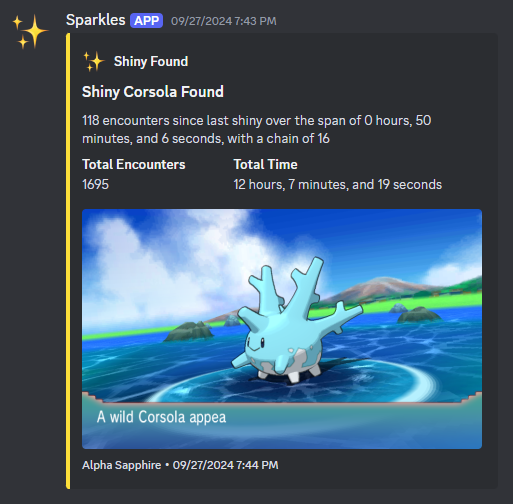
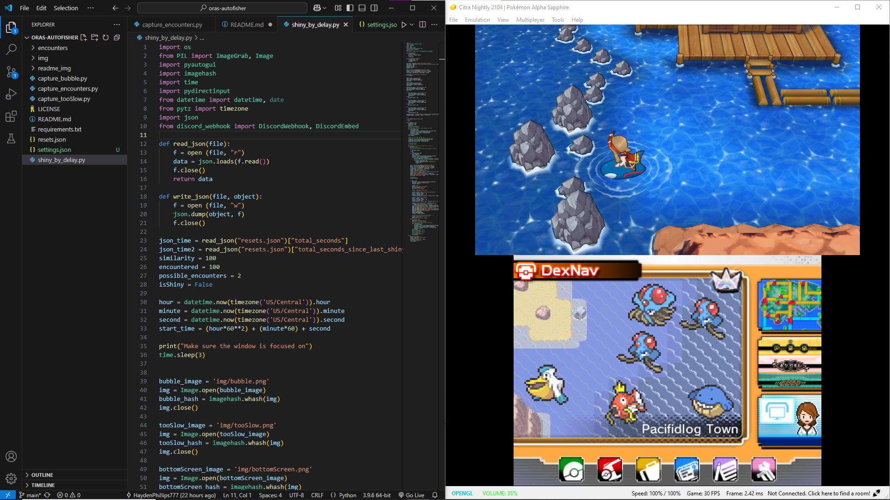
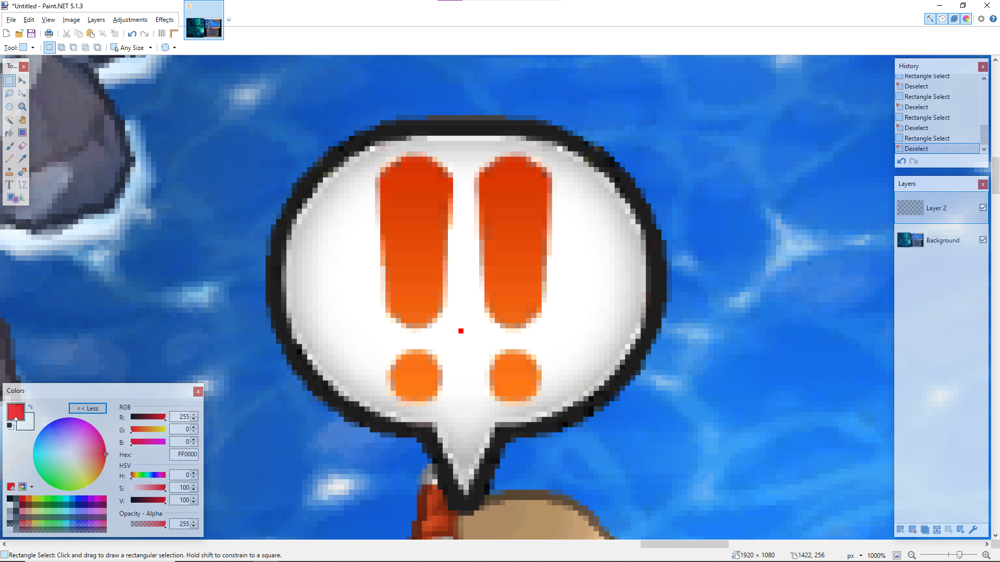
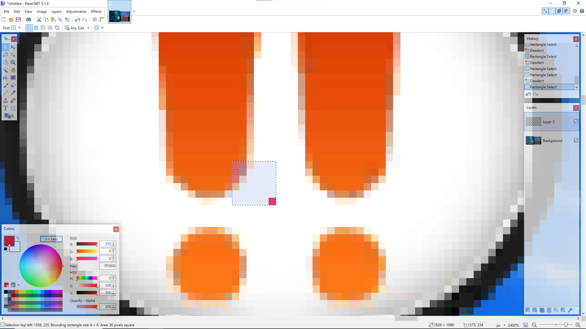
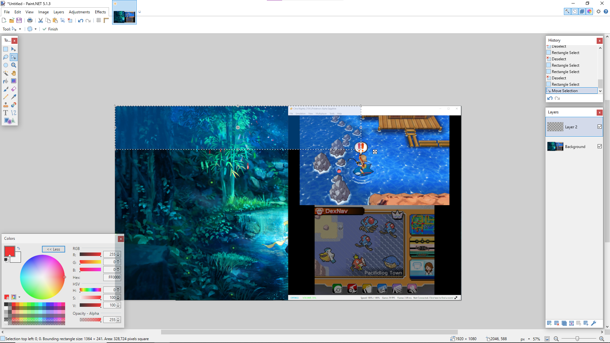
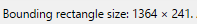

# ORAS AutoFisher
A python program for Omega Ruby and Alpha Sapphire playing on Citra that automatically fishes for you until it finds a shiny  

This is a project I was really proud of at the time, but now that I'm uploading my stuff to GitHub I realize how not user-friendly this is.  

I don't have any plans to update this, or even write instructions on how to set this up for yourself. This repository was really only created as a way to archive and showcase a project I was proud of.  
# Features
## Automatic Fishing
Through the `pydirectinput` library, the program is able to send inputs to the game. After sending the input to send your fishing rod out, the program will monitor the screen until the exclamation mark bubble appears. Once that shows up, it sends the input to reel it in.  
## Logging
Tracks the current chain, elapsed time, encounters, elapsed time since last shiny, and encounters since last shiny.
## Shiny Detection
In ORAS, shiny pokémon have a special animation that plays when they are encountered. This animation delays the appearance of the UI. So by monitoring the screen and seeing how long it takes for the UI to appear, we can tell if the pokémon encountered is a shiny or not. That's exactly what the program does.  

If the pokémon is shiny, then the program will stop. If the pokémon is not shiny, the program will send the inputs to run away from the encounter. After that, it starts fishing again.  
## Discord Notifying
Through the use of a discord webhook, the program will notify you when it finds a shiny.  

# Showcase
Here's a little video showing off the program in action  
https://github.com/user-attachments/assets/e70163cd-f107-4e91-9837-0fb4a49f178e

Ill move this later but for now i gotta write it somewhere

# Setup
I designed this program with a specific window position, size, and resolution. So if you're set up isn't the exact same as mine then you'll have some extra work to do.  
## My Setup
I have my setup organized like this:  
  
I'm on a `1080p` display, with my windows split so VS Code takes up the left half and the Citra emulator takes up the right half. In Citra, I have `Screen Layout` set to `Default` along with `Show Status Bar` enabled. If you replicate this setup, you might be able to skip a few steps, but I wouldn't recommend it.  
## Getting Positions
Most of this program relies on detecting colors to function so we need to make sure we configure everything so it can look for them.  
### Bubble
Step 1. Send out your fishing rod.  
Step 2. When the exclamation mark bubble appears, take a screenshot of your **whole** screen. Your screenshot should be the size of your display so if you have a `1080p` display, your screenshot should be `1920x1080` pixels.  
Step 3. Open the screenshot in an image editing software, I use paint.net(put a hyperlink here).  
Step 4. Determine how many pixels the specific pixel we will be focusing on is from the left and top of the image. The way I phrased that might be a little confusing so here is some visuals:  
  
The red pixel you see in that screenshot is the pixel we are aiming to find out the coordinates of (you shouldn't actually have a red pixel there, I just put it there so you could tell which pixel I was talking about). From here create a selection box that has the pixel in the bottom right corner, like this:  
  
From here, expand the selection box to the top right of your entire image, like this:  
  
Now look for the size of selection box, for me its located in the bottom left.  
  
Step 5. Now go into your `settings.json` file and located the area where it says `"bubble": [],`  
Step 6. Enter the two numbers you found, for me my numbers were 1364 and 241 so mine would like like this: `"bubble": [1364, 241]`  