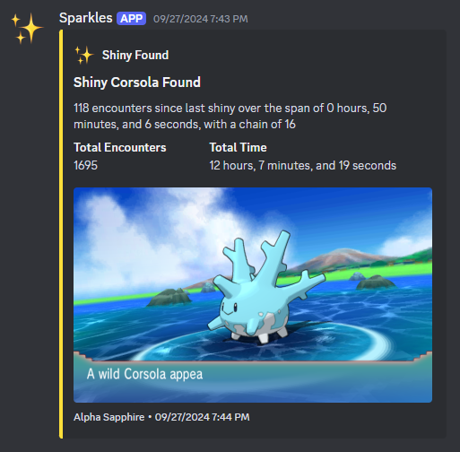
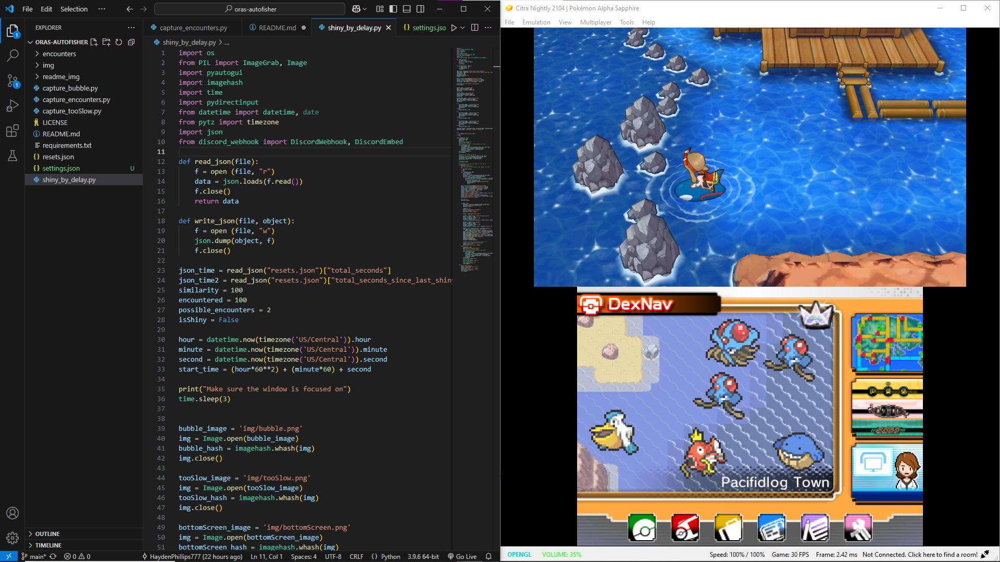
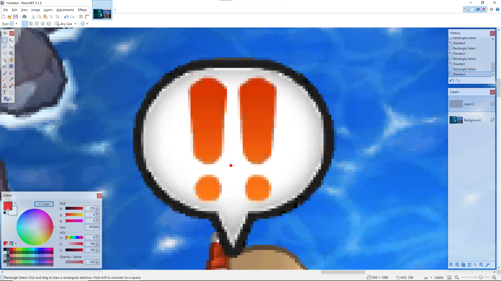
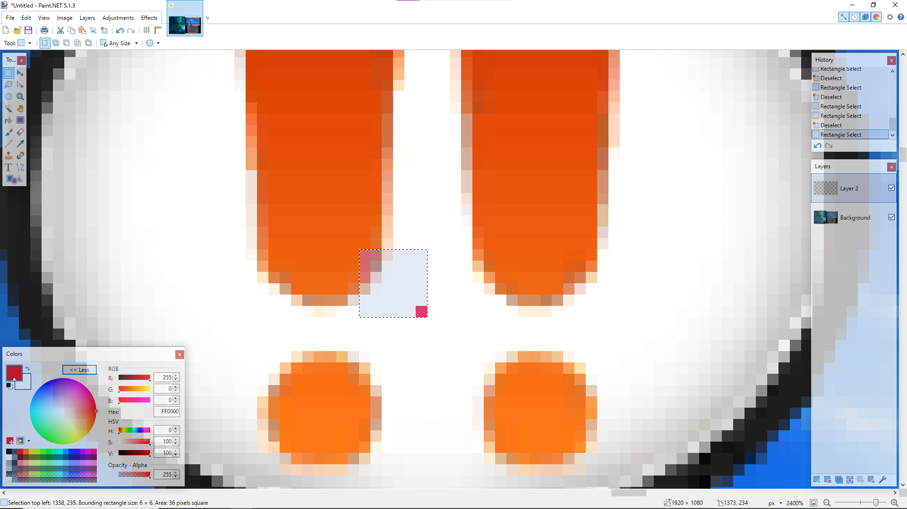
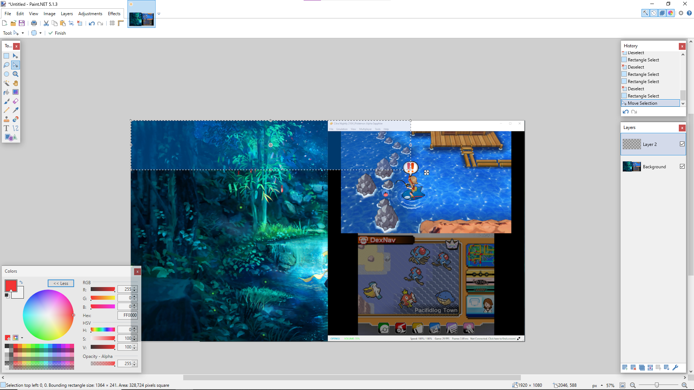
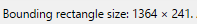

#   
# ORAS AutoFisher
A python program for Omega Ruby and Alpha Sapphire playing on Citra that automatically fishes for you until it finds a shiny  

This is a project I was really proud of at the time, but now that I'm uploading my stuff to GitHub I realize how not user-friendly this is.  

I don't have any plans to update this, or even write instructions on how to set this up for yourself. This repository was really only created as a way to archive and showcase a project I was proud of.  

**UPDATE:** I changed my mind and DID end up updating it. I've added a settings file and recoded a lot. The instructions probably aren't the best but I hope whoever is reading this is able to figure it out. Even with the changes I've made this still isn't perfect, though.
# Features
## Automatic Fishing
Through the `vgamepad` library, the program is able to send inputs to the game. After sending the input to send your fishing rod out, the program will monitor the screen until the exclamation mark bubble appears. Once that shows up, it sends the input to reel it in.  
## Logging
Tracks the current chain, elapsed time, encounters, elapsed time since last shiny, and encounters since last shiny.
## Shiny Detection
In ORAS, shiny pokémon have a special animation that plays when they are encountered. This animation delays the appearance of the UI. So by monitoring the screen and seeing how long it takes for the UI to appear, we can tell if the pokémon encountered is a shiny or not. That's exactly what the program does.  

If the pokémon is shiny, then the program will stop. If the pokémon is not shiny, the program will send the inputs to run away from the encounter. After that, it starts fishing again.  
## Discord Notifying
Through the use of a discord webhook, the program will notify you when it finds a shiny.  

# Showcase
Here's a little video showing off the program in action  
https://github.com/user-attachments/assets/e70163cd-f107-4e91-9837-0fb4a49f178e  
# Setup
I designed this program with a specific window position, size, and resolution. So if you're set up isn't the exact same as mine then you'll have some extra work to do. I didn't know where to put this but make sure you have your fishing rod registered.  
## My Setup
I have my setup organized like this:  
  
I'm on a `1080p` display, with my windows split so VS Code takes up the left half and the Citra emulator takes up the right half. In Citra, I have `Screen Layout` set to `Default` along with `Show Status Bar` enabled. If you replicate this setup, you might be able to skip a few steps, but I wouldn't recommend it.  
## Getting Positions
Most of this program relies on detecting colors to function so we need to make sure we configure everything so it can look for them.  
### Bubble
**Step 1.** Send out your fishing rod.  
**Step 2.** When the exclamation mark bubble appears, take a screenshot of your **whole** screen. Your screenshot should be the size of your display so if you have a `1080p` display, your screenshot should be `1920x1080` pixels.  
**Step 3.** Open the screenshot in an image editing software, I use [paint.net](https://www.getpaint.net/).  
**Step 4.** Determine how many pixels the specific pixel we will be focusing on is from the left and top of the image. The way I phrased that might be a little confusing so here is some visuals:  
  
The red pixel you see in that screenshot is the pixel we are aiming to find out the coordinates of (you shouldn't actually have a red pixel there, I just put it there so you could tell which pixel I was talking about). From here create a selection box that has the pixel in the bottom right corner, like this:  
  
From here, expand the selection box to the top right of your entire image, like this:  
  
Now look for the size of selection box, for me its located in the bottom left.  
  
**Step 5.** Now go into your `settings.json` file and locate where it says `"bounding_boxes"` and then look for area inside it where it says `"bubble": []`  
**Step 6.** Enter the two numbers you found, for me my numbers were 1364 and 241 so mine would like like this: `"bubble": [1364, 241]`  
**Step 7.** Take the RGB values of the pixel and enter it in the `"bubble": []` section under `"colors"`, yours should look something like this: `"bubble": [255, 255, 255]`
### Too Slow
**Step 1.** Send out your fishing rod.  
**Step 2.** Purposely do not reel in the catch so that the text box saying you were "too slow" appears on screen.  
From here you repeat basically the same steps explained in the bubble section. The pixel you want to aim for this time should be one of the red parts near the bottom of the text box. Make sure you save the position and color.
### Encounter Names
**Step 1.** Fish up an encounter.  
**Step 2.** When the text box that says "A wild something appeared" Take a screenshot of the whole screen.  
**Step 3.** Use the selection tool to make a box around the encounter's name. You don't want it to be too big but you also don't want it to be too small. For reference, here's the crop that I use:  
  
Yes, part of the name is cropped out but that is fine.  
**Step 4.** Find the distance of each side from 0. For me, the left side of my selection is 1139 pixels from 0 and my right side is 1231 pixels from it.  
**Step 5.** Enter the numbers you found into `settings.json` in the `"encounter": []` area under `"bounding_boxes"`. It should be formatted like this: `"encounter": [left, top, right, bottom]`. For reference, here is mine: `"encounter": [1139, 467, 1231, 501]`.  
### Top Screen
**Step 1.** Take a screenshot of your whole screen.  
**Step 2.** Repeat the steps you did for encounter names, you want to perfectly crop it so that it's just the top screen of the 3DS.  
**Step 3.** Enter the numbers you found into `settings.json` in the `"top_screen": []` area under `"bounding_boxes"`.  
### Bottom Screen
**Step 1.** Take a screenshot of your whole screen.  
**Step 2.** Pick any pixel to focus on in the bottom screen of the 3DS.  
**Step 3.** Repeat the steps you did for bubble and too slow. At this point, you already know where to save the values, make sure you save the color, though. The color should just be solid black, but depending on your display settings, it could be slightly different so that's why you're saving it.  
## Settings
We've already been exploring the settings quite a bit but there's still more to do. The names of the settings are self explanatory so I'm sure you can figure it out yourself. The one part I will address though is the `"encounter_names"` setting. The order of the names should be the same order as they are in the `encounters` folder. So if Staryu is my `encounter1.png` then Staryu will be the first name in `"encounter_names"`.  
# Usage
## `register_gamepad.py`
This is just a simple python script used to help setup controls. Go to the controls section in Citra and create a new profile, the name doesn't matter. Click the "Auto Map" button and then start the python script. The python script will start counting down, before it finishes click the "OK" button on the popup from Citra. If everything worked correctly, the controller should be mapped.  
## `capture_encounters.py`
For the main part of this program to work, you first need screenshots of each possible encounter, that's what this python script is for. Based on the value you set for `"possible_encounters"` the program will run until it has that many different screenshots. Note: this script does not have shiny detection, so if you're unfortunate enough to run into a shiny while this script is running, the shiny will be ignored.  
## `shiny_by_delay.py`
This is where everything really goes down. If you've successfully setup everything else then you just have to let this program run. Once it finds a shiny you'll be notified. This also logs the encounters and time spent to `resets.json` but note that most of the values don't reset on their own, so after you get a shiny you gotta go reset it yourself.